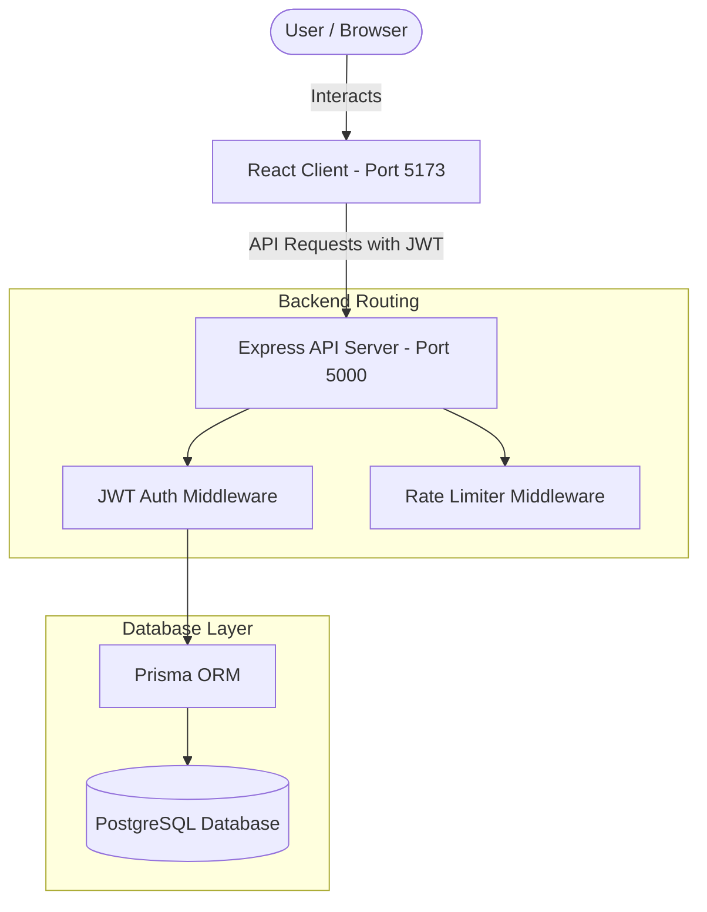

# SnapLink — Premium URL Shortener & Analytics

SnapLink is a full-stack, secure, and fast URL shortener application built with React, Node.js/Express, and Prisma ORM with PostgreSQL. It supports advanced link analytics, QR code generation, bulk shortening, custom aliases, and expiration settings.

---

## 🏗️ Architecture Diagram



---

## ⚡ Features & Capabilities
1. **Custom Alias**: Users can brand their URLs by defining custom short paths.
2. **Link Expiration**: Set an optional date/time after which the link yields a `410 Gone` code.
3. **Automatic QR Codes**: High-quality downloadable QR codes generated server-side.
4. **CSV Bulk Shortening**: Upload a CSV file to shorten up to hundreds of links concurrently.
5. **Real-time Analytics**: Tracks device types, web browsers, and country origins based on IP.
6. **Double-layer Auth**: Fast JWT access tokens combined with automatic refresh rotation.

---

## ⚙️ Setup & Installation Instructions

### Prerequisites
- [Node.js](https://nodejs.org/) (v18.0.0 or higher recommended)
- [PostgreSQL](https://www.postgresql.org/) (running local instance or remote host)

---

### Step 1: Clone and Configure Environment Files
1. Create a `.env` file inside the `server/` directory based on the `.env.example` file:
```env
DATABASE_URL="postgresql://<username>:<password>@<host>:<port>/snaplink?schema=public"
PORT=5000
BASE_URL="http://localhost:5000"
CLIENT_URL="http://localhost:5173"
JWT_SECRET="generate-a-long-random-string-for-security"
JWT_EXPIRES_IN="7d"
```

---

### Step 2: Database Migration & Schema Sync
In the `server/` folder, run the following commands to initialize the database and compile the Prisma client:
```bash
# Move to server directory
cd server

# Install dependencies
npm install

# Run database migration to create the tables in PostgreSQL
npx prisma migrate dev --name init

# Generate Prisma Client
npx prisma generate
```

---

### Step 3: Run the API Server
Start the Express backend in development mode (with hot-reload):
```bash
npm run dev
```
The server will boot on `http://localhost:5000`.

---

### Step 4: Run the React Client
Open a new terminal window, move to the `client/` folder, install dependencies, and boot the Vite server:
```bash
# Move to client directory
cd ../client

# Install dependencies
npm install

# Run development server
npm run dev
```
The React frontend will boot on `http://localhost:5173`.

---

## 📝 Assumptions Made
1. **Guest URL Shortening**: Guest users can use the shortening form on the landing page, but their shortened links are created without a `userId` connection and will not populate on any user dashboard.
2. **Redirect Redundant Lookup Fallback**: In offline or localized network environments, client IP address geolocations (`ip-api.com` lookups) default gracefully to "Local / Unknown" to prevent redirection delay or crash.
3. **Database Cascades**: Deleting a short URL deletes all corresponding visits and analytics automatically. Deleting a user account cascades to delete all their shortened links.

---

## 🤖 AI Planning & Development Log
- **Initial Discovery**: Checked local developer environments, finding Node.js and npm active, but PostgreSQL commands detached. Scaffolding is built to query connections from environment variables cleanly.
- **Backend Design**: Implemented modular routing separating controllers (`auth`, `url`, `analytics`, `redirect`) and middleware (`auth`, `rateLimiter`, `errorHandler`). Built secure, secure-by-default custom unique 6-character short code generator.
- **Frontend Design**: Built a custom theme system using HSL color tokens to match shadcn/ui. Implemented full caching states and data-mutations using React Query. Recharts is used for high-fidelity click trends and client breakdowns.

---

## 🎥 Demonstration Video
[Link to Loom / YouTube Video Demo Placeholder]

---

This project is a part of a hackathon run by https://katomaran.com


Demo Link : https://youtu.be/9ojOzPvixXU?si=9Oyl9HNP3NWwP6Ej
